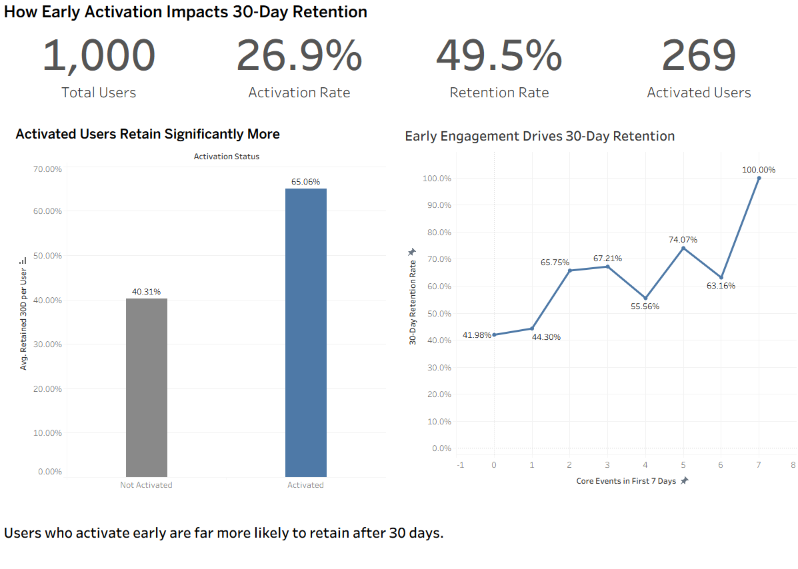

# Activation & Retention Analysis (SQL)

## Key Results

- Activated users: **65.1% 30-day retention** (175 / 269)
- Non-activated users: **25.0% retention** (183 / 731)
- Early activation is associated with a **40+ percentage point increase** in retention

---

## Project Overview

This project examines how early user activation within the first 7 days impacts long-term retention.

The analysis shows that users who complete key activation behaviors early are significantly more likely to remain active after 30 days, highlighting activation as a critical driver of product retention.

---

## Business Question

Do users who complete key activation behaviors within the first 7 days show higher long-term retention?

---

## Approach

- Built a layered SQL pipeline to transform raw event data into activation and retention metrics  
- Defined activation based on meaningful early engagement (core feature usage + repeat activity)  
- Compared 30-day retention outcomes between activated and non-activated users  

---

## SQL Pipeline

The analysis is implemented as a structured set of SQL views:

1. **Early Event Window (0–6 days)**  
   Filters events within the first 7 days after signup  

2. **Early Engagement Metrics**  
   Aggregates:
   - total events  
   - core feature usage  
   - number of active days  

3. **Activation Labeling**  
   Classifies users as activated vs non-activated  

4. **Retention Labeling**  
   Identifies users active on or after Day 30  

5. **Final Summary**  
   Compares retention outcomes by activation status  

This structure reflects how analytics teams build reusable data layers rather than relying on one-off queries.

---

## Dashboard

The Tableau dashboard presents:

- Activation and retention KPIs  
- Retention differences between activated and non-activated users  
- The relationship between early engagement and retention  

---

## Product Implications

- Prioritize onboarding flows that drive early core feature usage  
- Encourage repeat engagement within the first week  
- Identify and target non-activated users early  

---

## Definitions

### Activation (First 7 Days)

A user is considered activated if both conditions are met within Day 0–6 after signup:

- At least one core feature event  
- Activity on at least two distinct days  

This definition captures both meaningful usage and repeat engagement.

---

### Retention (30 Days)

A user is considered retained if they have at least one event on or after Day 30 following signup.

---

## Dataset

Two relational tables:

**users**
- user_id  
- signup_date  

**events**
- user_id  
- event_time (DATE)  
- event_type  

Each event represents a user action within the product, including a core feature event.

---

## Tools

- SQL (BigQuery-style views, aggregations, conditional logic)  
- Tableau (dashboard visualization)  
